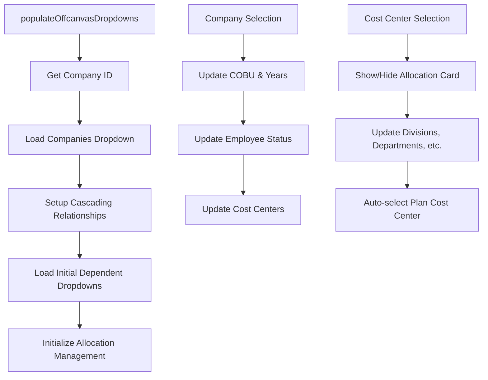
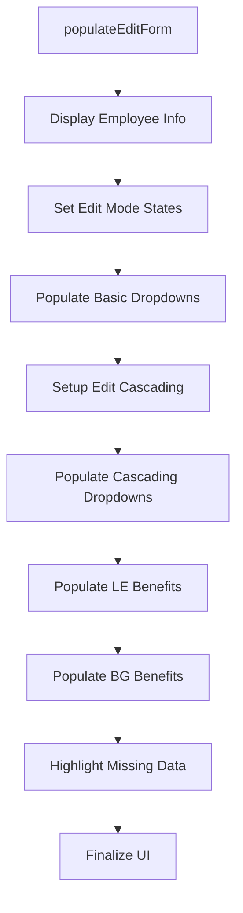
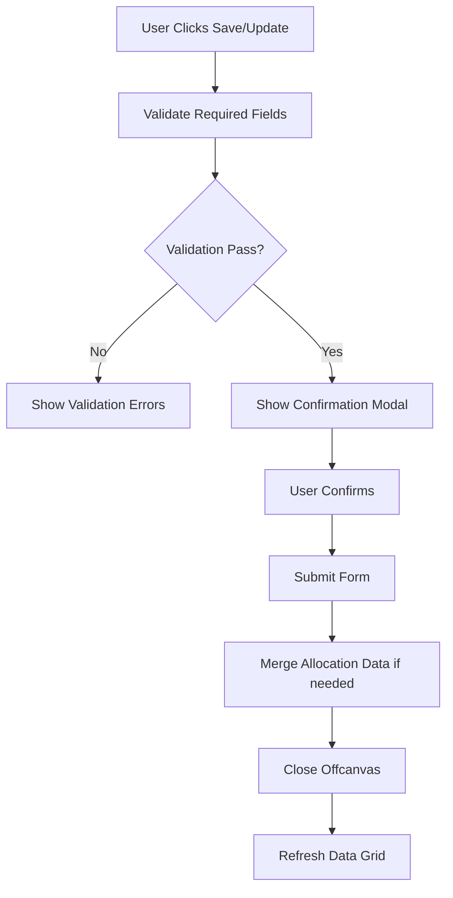
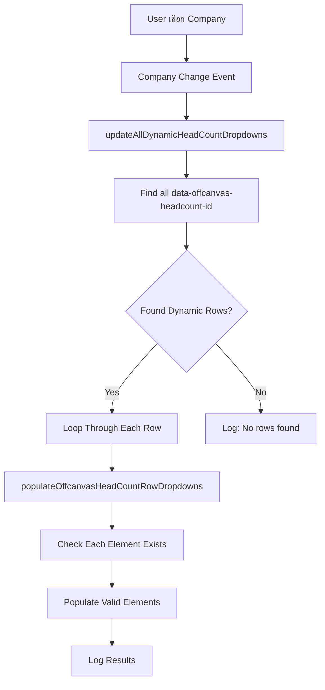

# Budget Offcanvas Workflow Documentation

## 📋 Overview
`budget.offcanvas.js` จัดการ offcanvas operations, form management, dropdown cascading และ **Dynamic Head Count Management** สำหรับระบบ Budget Management

**🕐 Last Updated**: October 7, 2025 15:30 (UTC+7)  
**🔄 Major Changes**: Implemented **Option 1: Pure Dynamic Approach** สำหรับ Dynamic Head Count Management

## 🏗️ Architecture Components

### 1. Modal Control System
- **Purpose**: ป้องกันการปิด modal/offcanvas โดยไม่ได้ตั้งใจ
- **Components**:
  - `allowOffcanvasClose` - ควบคุมการปิด offcanvas
  - `allowSaveClose` - ควบคุมการปิด save modal  
  - `allowUpdateClose` - ควบคุมการปิด update modal

### 2. Dropdown Population System
- **Purpose**: โหลดข้อมูลจาก API มาแสดงใน dropdown fields
- **Key Functions**:
  - `populateOffcanvasDropdowns()` - หลัก function สำหรับโหลด dropdowns ทั้งหมด
  - Individual update functions สำหรับแต่ละ dropdown
  - **🆕 Dynamic Head Count Functions** - จัดการ dropdown ใน dynamic head count rows แยกต่างหาก

### 3. Cascading Relationships
- **Purpose**: จัดการความสัมพันธ์แบบลูกโซ่ระหว่าง dropdowns
- **Modes**: Add mode และ Edit mode มี cascading logic แยกกัน

### 4. 🆕 Dynamic Head Count Management (Option 1 Implementation)
- **Purpose**: จัดการ Head Count Distribution rows แบบ dynamic
- **Architecture**: **Clean Separation Approach** - แยกการจัดการ static fields กับ dynamic fields อย่างสมบูรณ์
- **Key Features**:
  - Dynamic row creation/removal
  - Individual row dropdown population
  - Company-based dropdown updates
  - Element detection and validation

---

## 🔄 Main Workflow Steps

### Step 1: Initialize Offcanvas System
```javascript
// Entry Point: initializeOffcanvasHandlers()
1. Setup event listeners สำหรับ offcanvas hide events
2. Initialize Modal Control System
3. Setup button click handlers
4. Initialize fullscreen offcanvas integration (ถ้ามี)
```

### Step 2: Populate Dropdowns on Offcanvas Open
```javascript
// Entry Point: populateOffcanvasDropdowns()
1. Get current company ID
2. Load basic dropdowns (Companies, COBU, Years)
3. Setup cascading relationships based on mode (Add/Edit)
4. Initialize allocation management
5. Populate dependent dropdowns based on current selections
```

### Step 3: Setup Cascading Relationships
```javascript
// For Add Mode: setupOffcanvasDropdownRelationshipsForAdd()
1. Remove existing event listeners (prevent duplicates)
2. Setup Company change → Update all dependent dropdowns
3. Setup COBU/Year change → Update cost centers and related
4. Setup Cost Center change → Show/hide allocation card + update divisions
5. Setup hierarchical cascade (Division → Department → Section → Location)
6. Setup Position → Job Band → Salary Range cascade
```

### Step 4: Handle Form Interactions
```javascript
// User interactions trigger cascading updates
1. User selects Company → Trigger updateOffcanvasEmpFormats, Years, etc.
2. 🆕 Company change → Trigger Dynamic Head Count dropdown updates (Option 1)
3. User selects Cost Center → Show allocation card + update divisions
4. User selects Position → Update job bands and salary ranges
5. Each selection triggers debounced API calls to prevent rapid requests

// ⭐ OPTION 1 IMPLEMENTATION - Dynamic Head Count Management
// Static field functions (editEmpType, editNewHC, etc.) are DISABLED to prevent "Element not found" errors
// Only Dynamic Head Count rows (offcanvas_headcount_X_fieldName) are populated
```

### Step 4.1: 🆕 Dynamic Head Count Management Flow
```javascript
// Entry Point: Company Selection in Offcanvas
1. User selects Company → updateAllDynamicHeadCountDropdowns()
2. Detect all [data-offcanvas-headcount-id] elements
3. For each dynamic row: populateOffcanvasHeadCountRowDropdowns(rowId, companyId)
4. Individual element checking: empType, newHC, newPeriod, newLEPeriod, etc.
5. API calls for each valid element found
6. Real-time logging for debugging and monitoring
```

### Step 5: Edit Mode Population (When editing existing row)
```javascript
// Entry Point: populateEditForm(rowData)
1. Display employee information in header
2. Set field states for edit mode
3. Populate basic dropdowns sequentially
4. Setup edit mode cascading
5. Populate cascading dropdowns with dependencies
6. Populate benefits data (LE and Budget Year)
7. Highlight missing critical data
8. Finalize UI state (show Update button, hide Save button)
```

### Step 6: Form Validation and Submission
```javascript
// Validation Flow
1. User clicks Save/Update → Trigger validation
2. Check required fields using validateRequiredFields()
3. Validate form data using validateOffcanvasFormData()
4. Show confirmation modal if validation passes
5. Handle form submission after confirmation
6. Merge allocation data if Cost Center = '90066'
7. Close offcanvas safely after submission
```

---

## 🔗 Detailed Component Flows

### A. Dropdown Population Flow


### B. Edit Mode Population Flow


### C. Form Submission Flow


---

## 🎯 Key Functions Reference

### Modal Control Functions
- `preventOffcanvasHide(e)` - ป้องกันการปิด offcanvas
- `safeCloseOffcanvas()` - ปิด offcanvas อย่างปลอดภัย
- `preventSaveModalHide(e)` - ป้องกันการปิด save modal
- `safeCloseSaveModal()` - ปิด save modal อย่างปลอดภัย

### Static Dropdown Management Functions (Traditional Edit Form)
- `populateOffcanvasDropdowns()` - โหลด static dropdowns ทั้งหมด
- `updateOffcanvasCoBU(companyID)` - อัพเดท COBU dropdown
- `updateOffcanvasCostCenters()` - อัพเดท Cost Centers dropdown
- `updateOffcanvasEmpStatus()` - อัพเดท Employee Status dropdown
- ⚠️ **Static Field Functions (DISABLED in Option 1)**:
  - `updateOffcanvasEmployeeTypes()` - **COMMENTED OUT** (editEmpType not found)
  - `updateOffcanvasNewHC()` - **COMMENTED OUT** (editNewHC not found)
  - `updateOffcanvasNewPeriod()` - **COMMENTED OUT** (editNewPeriod not found)
  - `updateOffcanvasNOfMonth()` - **COMMENTED OUT** (editNOfMonth not found)
  - `updateOffcanvasNewLEPeriod()` - **COMMENTED OUT** (editNewLEPeriod not found)
  - `updateOffcanvasLEnOfMonth()` - **COMMENTED OUT** (editLEnOfMonth not found)

### 🆕 Dynamic Head Count Management Functions (Option 1)
- `updateAllDynamicHeadCountDropdowns()` - Main function ใน Option 1, หา dynamic rows ทั้งหมดและ populate
- `populateOffcanvasHeadCountRowDropdowns(rowId, companyId)` - Populate ฟิลด์ใน dynamic row เฉพาะ
- `setupDynamicHeadCountCompanyListener()` - Setup dedicated event listener สำหรับ dynamic head count
- `addOffcanvasHeadCountRow()` - เพิ่ม dynamic head count row ใหม่
- `removeOffcanvasHeadCountRow(rowId)` - ลบ dynamic head count row

### Cascading Setup Functions  
- `setupOffcanvasDropdownRelationshipsForAdd()` - Setup cascading สำหรับ Add mode
- `setupOffcanvasDropdownRelationshipsForEdit()` - Setup cascading สำหรับ Edit mode
- `clearOffcanvasDropdowns(dropdownIds)` - ล้างค่า dropdown ที่ระบุ

### Edit Form Population Functions
- `populateEditForm(rowData)` - หลัก function สำหรับ populate edit form
- `populateAndSelectBasicDropdowns(rowData)` - Populate dropdowns พื้นฐาน
- `populateAndSelectCascadingDropdowns(rowData)` - Populate dropdowns แบบ cascading
- `populateLeBenefitsData(rowData)` - Populate LE benefits data
- `populateBgBenefitsData(rowData)` - Populate Budget Year benefits data

### Validation Functions
- `validateRequiredFields(formMode)` - ตรวจสอบ required fields
- `validateOffcanvasFormData()` - ตรวจสอบความถูกต้องของข้อมูลฟอร์ม
- `highlightMissingBenefitsData(rowData)` - ไฮไลท์ข้อมูล benefits ที่ขาดหาย

### Utility Functions
- `autoSelectWithRetry(elementId, value, maxRetries)` - เลือกค่า dropdown พร้อม retry mechanism
- `isDropdownReady(elementId)` - ตรวจสอบว่า dropdown พร้อมใช้งาน
- `formatEmployeeName(rowData)` - จัดรูปแบบชื่อพนักงาน
- `showValidationError(message)` - แสดง validation error message
- `clearValidationErrors()` - ล้าง validation errors

---

## 🔄 Dynamic Head Count Management (Option 1 Implementation Details)

### 📋 Problem Solved
**Issue**: Dynamic Head Count dropdowns ไม่แสดงข้อมูล + "Element not found" errors
**Root Cause**: Static field functions พยายาม populate elements ที่ไม่มีอยู่ใน Dynamic Head Count section
**Solution**: **Option 1 - Pure Dynamic Approach** แยกการจัดการสมบูรณ์

### 🏗️ Option 1 Architecture
```javascript
// 1. STATIC FIELDS (Traditional Edit Form) - มี element IDs: editEmpType, editNewHC
//    → Handled by: updateOffcanvasEmployeeTypes(), updateOffcanvasNewHC(), etc.
//    → Status: DISABLED เพื่อป้องกัน "Element not found" errors

// 2. DYNAMIC FIELDS (Head Count Distribution) - มี element IDs: offcanvas_headcount_1_empType
//    → Handled by: updateAllDynamicHeadCountDropdowns() → populateOffcanvasHeadCountRowDropdowns()
//    → Status: ACTIVE และทำงานเฉพาะ dynamic fields เท่านั้น
```

### 🔧 Key Implementation Changes (October 7, 2025)
```javascript
// Company Change Event Handler (Line ~70-100)
$('#editCompany').on('change.offcanvas', function () {
  // ✅ ENABLED: Static dropdowns ที่มีอยู่จริง
  updateOffcanvasEmpFormats(companyID);
  updateOffcanvasYears(companyID);
  debouncedUpdateOffcanvasCostCenters();
  
  // ❌ DISABLED: Static field functions ที่ทำให้เกิด "Element not found"
  // debouncedUpdateOffcanvasEmployeeTypes(); // editEmpType not found
  // debouncedUpdateOffcanvasNewHC(); // editNewHC not found
  
  // ⭐ ADDED: Direct Dynamic Head Count update
  setTimeout(() => {
    updateAllDynamicHeadCountDropdowns(); // Update เฉพาะ dynamic fields
  }, 100);
});
```

### 🎯 Dynamic Head Count Flow


---

## ⚡ Performance Optimizations

### 1. Debounced API Calls (Static Fields Only)
```javascript
// ป้องกัน API calls ที่เร็วเกินไป - สำหรับ static fields เท่านั้น
const debouncedUpdateOffcanvasCostCenters = debounce(updateOffcanvasCostCenters, 300);
const debouncedUpdateOffcanvasDivisions = debounce(updateOffcanvasDivisions, 300);
// Note: Dynamic Head Count ใช้ immediate update เพื่อ responsiveness
```

### 2. 🆕 Immediate Updates for Dynamic Fields
```javascript
// Dynamic Head Count ใช้ immediate update แทน debouncing
setTimeout(() => {
  updateAllDynamicHeadCountDropdowns(); // No debouncing
}, 100); // เพียง 100ms delay เพื่อให้ static dropdowns โหลดก่อน
```

### 2. Sequential Processing
```javascript
// Edit form population ใช้ sequential processing แทน parallel เพื่อป้องกัน race conditions
async function processEditFormPopulation(rowData) {
  await populateAndSelectBasicDropdowns(rowData);
  await new Promise(resolve => setTimeout(resolve, 400));
  await populateAndSelectCascadingDropdowns(rowData);
  // ... continue sequentially
}
```

### 3. Retry Mechanisms
```javascript
// Auto-select มี retry mechanism สำหรับ dropdown ที่ยังโหลดไม่เสร็จ
function autoSelectWithRetry(elementId, value, maxRetries = 5) {
  // Retry logic with exponential backoff
}
```

---

## 🔧 Integration Points

### 1. Allocation Management Integration
```javascript
// เรียก allocation management เมื่อ Cost Center = '90066'
if (selectedValue === AllocationCostCenterCode) {
  // Show allocation card and initialize management
}
```

### 2. Validation System Integration  
```javascript
// ใช้ unified validation system จาก budget.form.validation.js
if (window.budgetFormValidator) {
  const validationResult = window.budgetFormValidator.validateForm();
}
```

### 3. Dynamic Forms Integration
```javascript
// รอให้ Dynamic Forms สร้าง DOM elements ก่อน populate
setTimeout(() => {
  if (typeof initializeAllocationManagement === 'function') {
    initializeAllocationManagement();
  }
}, 300);
```

---

## 📱 Responsive and Accessibility Features

### 1. Fullscreen Integration
```javascript
// Integration กับ fullscreen offcanvas manager
if (typeof window.initializeOffcanvasFullscreenManager === 'function') {
  // Auto-initialize fullscreen management
}
```

### 2. Focus Management
```javascript
// ป้องกัน ARIA focus errors
document.activeElement.blur();
```

### 3. Backdrop Control
```javascript
// ป้องกัน backdrop click จากการปิด offcanvas โดยไม่ได้ตั้งใจ
document.addEventListener('mousedown', function (e) {
  const backdrop = document.querySelector('.offcanvas-backdrop');
  if (backdrop && e.target === backdrop && !allowOffcanvasClose) {
    e.preventDefault();
  }
});
```

---

## 🚨 Error Handling

### 1. API Error Handling
```javascript
try {
  // API calls with proper error handling
  populateDropdown(elementId, apiUrl, placeholder, optionMapper);
} catch (error) {
  console.error('Error updating dropdown:', error);
  showWarningModal(error.message);
}
```

### 2. Validation Error Display
```javascript
// แสดง validation errors ใน CoreUI alert format
function showValidationError(message) {
  const alertHtml = `
    <div class="alert alert-danger alert-dismissible fade show validation-alert" role="alert">
      <i class="fa-solid fa-exclamation-circle me-2"></i>
      <strong>Validation Error:</strong><br>
      ${message}
    </div>
  `;
}
```

### 3. Graceful Degradation
```javascript
// ตรวจสอบ function availability ก่อนเรียกใช้
if (typeof initializeAllocationManagement === 'function') {
  initializeAllocationManagement();
} else {
  console.warn('Allocation management function not available');
}
```

---

## 📚 Dependencies

### External Dependencies
- **jQuery** - DOM manipulation และ event handling
- **Bootstrap/CoreUI** - Modal และ offcanvas functionality  
- **Select2** - Enhanced dropdown functionality

### Internal Dependencies
- **budget.form.validation.js** - Validation system integration
- **budget.allocation.js** - Allocation management integration
- **budget.core.js** - Core utility functions และ API endpoints
- **budget.api.js** - Enhanced populateDropdown() function with initOptions parameter
- **🆕 budget.headcount.js** - Dynamic head count management (if exists)

### API Endpoints Used by Dynamic Head Count
- `SELECT_API.employeeTypes` - Employee type data สำหรับ dynamic dropdowns
- `SELECT_API.newHC` - New HC options สำหรับ dynamic dropdowns
- `SELECT_API.noOfMonths` - New Period และ No. of Month options
- `SELECT_API.leNoOfMonths` - LE Period และ LE No. of Month options
- `SELECT_API.joinPvf` - Join PVF options

### Traditional API Endpoints (Static Fields)
- `BUDGET_API.companies` - รายชื่อบริษัท
- `BUDGET_API.cobu` - COBU data
- `BUDGET_API.costCenters` - Cost center data  
- `SELECT_API.statuses` - Employee status data
- และ API endpoints อื่น ๆ สำหรับ static dropdown data

---

## 🔄 Lifecycle Events

### 1. Initialization Phase
1. `DOMContentLoaded` → Load script
2. `initializeOffcanvasHandlers()` → Setup event listeners
3. Setup modal control system
4. Initialize fullscreen integration

### 2. Offcanvas Open Phase  
1. User clicks Add/Edit button
2. `populateOffcanvasDropdowns()` → Load initial data
3. Setup cascading relationships
4. Initialize allocation management (if needed)

### 3. User Interaction Phase
1. User selects dropdown values
2. Trigger cascading updates via debounced functions
3. Real-time validation (if enabled)
4. Show/hide allocation card based on cost center

### 4. Form Submission Phase
1. User clicks Save/Update
2. Validate required fields
3. Show confirmation modal
4. Submit form data
5. Merge allocation data (if needed)
6. Close offcanvas and refresh grid

### 5. Cleanup Phase
1. Remove event listeners
2. Clear validation states
3. Reset modal control flags
4. Dispose tooltips and other UI components

---

## 🎯 Best Practices Implemented

### 1. **Event Listener Management**
- Remove existing listeners before adding new ones (prevent duplicates)
- Use namespaced events (`.offcanvas`, `.editMode`) for easier cleanup

### 2. **API Call Optimization** 
- Debounced functions ป้องกัน rapid API calls
- Sequential processing สำหรับ dependent operations
- Retry mechanisms สำหรับ unreliable operations

### 3. **Error Handling**
- Try-catch blocks สำหรับทุก critical operations  
- Graceful degradation เมื่อ dependencies ไม่พร้อม
- User-friendly error messages

### 4. **Performance**
- Lazy loading สำหรับ allocation management
- Efficient DOM queries และ caching
- Minimal DOM manipulations

### 5. **Maintainability**
- Clear function naming และ documentation
- Modular architecture with clear separation of concerns
- Global exports สำหรับ integration กับ modules อื่น

---

---

## 🧪 Testing & Debugging (October 7, 2025)

### Console Logging for Dynamic Head Count
```javascript
// เมื่อทดสอบ Dynamic Head Count จะเห็น logs เหล่านี้:
🔄 [Company Change] Triggering dynamic head count update...
🔄 [OPTION 1] Updating all dynamic head count dropdowns for company: 1
🔍 [OPTION 1] Found 2 dynamic head count rows
🔍 [OPTION 1] Row 1: ID = offcanvas_headcount_1
🎯 [OPTION 1] Updating dropdowns for row: offcanvas_headcount_1
🔄 [OPTION 1] Populating offcanvas dropdowns for row: offcanvas_headcount_1 with company: 1
🔍 [offcanvas_headcount_1] Employee Type element: FOUND/NOT FOUND
📡 [offcanvas_headcount_1] Populating Employee Type dropdown...
```

### Common Issues & Solutions
```javascript
// Issue: "Element with id 'editEmpType' not found"  
// Solution: ✅ Fixed by disabling static field functions in Option 1

// Issue: Dynamic dropdowns empty
// Solution: ✅ Check console logs to verify row detection and element existence

// Issue: API calls not triggered
// Solution: ✅ Verify company selection and setTimeout timing
```

### Performance Monitoring
- **Static Dropdowns**: 300ms debounced updates
- **Dynamic Dropdowns**: Immediate updates with 100ms initial delay
- **Element Detection**: Real-time existence checking
- **API Efficiency**: Individual element validation before API calls

---

## 🔄 Migration Notes (Future Considerations)

### From Option 1 to Other Approaches
```javascript
// หากต้องการ revert หรือเปลี่ยนแปลง approach:

// 1. Re-enable static field functions:
debouncedUpdateOffcanvasEmployeeTypes(); // Uncomment
debouncedUpdateOffcanvasNewHC(); // Uncomment

// 2. ปรับปรุง element detection:
if (document.getElementById('editEmpType')) {
  // Static field exists, use traditional approach
}

// 3. Hybrid approach:
// Check if in Dynamic Head Count context หรือ Traditional Edit context
const isDynamicContext = document.querySelector('[data-offcanvas-headcount-id]');
```

### Code Quality & Maintenance
- **✅ Separation of Concerns**: Static vs Dynamic fields มีการจัดการแยกกันชัดเจน
- **✅ Error Prevention**: Element existence checking ป้องกัน runtime errors
- **✅ Debugging Support**: Comprehensive logging สำหรับ troubleshooting
- **✅ Performance Optimization**: ใช้ immediate updates สำหรับ dynamic fields
- **✅ Backward Compatibility**: Static field functions ยังคงอยู่ (แค่ disable)

---

*📅 Last Updated: **October 7, 2025 15:30 (UTC+7)***  
*🔄 Major Update: **Option 1 - Pure Dynamic Approach Implementation***  
*🔗 Related Files: budget.form.validation.js, budget.allocation.js, budget.core.js, **budget.api.js***  
*👤 Updated By: **AI Assistant** - Dynamic Head Count Management Implementation*
